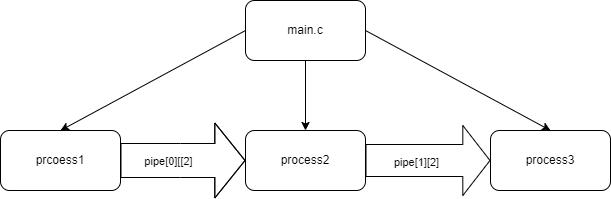
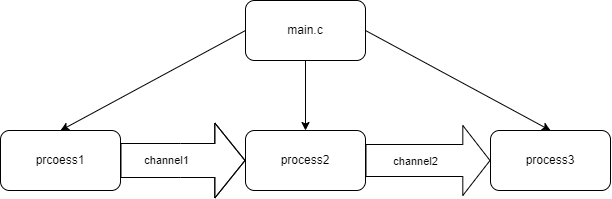
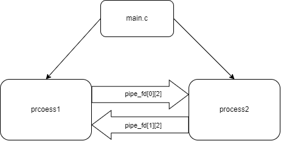
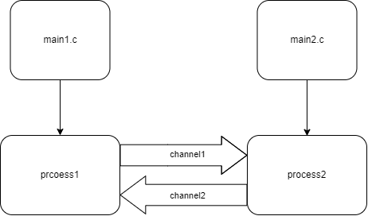
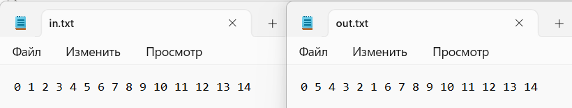
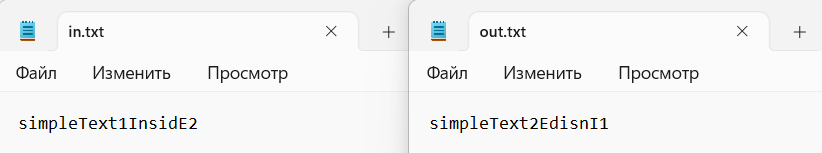
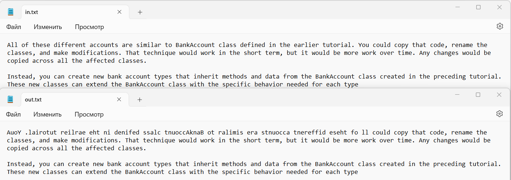
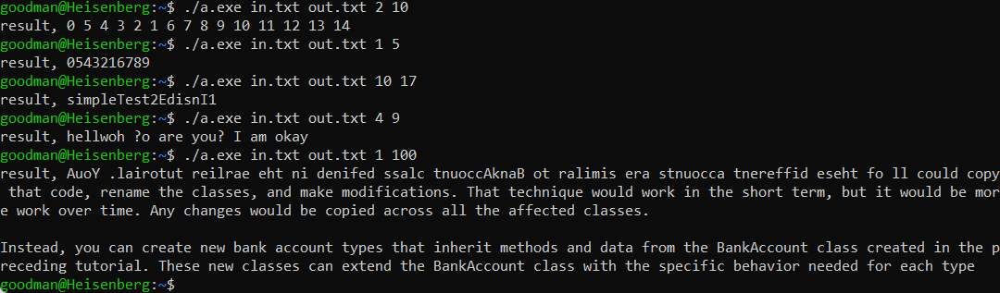

# # ИДЗ по ОС № 1
## Задание
- ### **формулировка**
    Вариант 1. Разработать программу, которая «переворачивает» заданную позициями N1–N2 часть ASCII–строки символов (N1, N2 вводятся как параметры). 
    Выполнено на оценку 9
- ### **аргументы командной строки при запуске пограмм**
    первый аргумент - имя входного файла; 
    второй аргумент - имя выходного файла; 
    третий аргумент - N1; 
    четвёртый аргумент - N2; 
    пример: 
    > ./a.exe in.txt out.txt 3 9
## Выполнение задания для каждого критерия
- ### **на оценкку 4**
    #### *схема решаемой задачи:*
    > 
    
    pipe_fd[0][2] - массив файловых дескрипторов для первого неименованного канала для передачи данных между первым и вторым процессом. 
    pipe_fd[1][2] - соответственного между вторым и третьим процессом.
 - ### **на оценкку 5**
    #### *схема решаемой задачи:*
    > 
    
    channel1 - именованный канал для передачи данных между первым и вторым процессом. 
    channel2 - именованный канал для передачи данных между вторым и третьим процессом. .
 - ### **на оценкку 6**
    #### *схема решаемой задачи:*
    > 
    
    pipe_fd[0][2] - массив файловых дескрипторов для первого неименованного канала для передачи данных между из первого процесса во второй. 
    pipe_fd[1][2] - массив файловых дескрипторов для первого неименованного канала для передачи данных между из второго процесса обратно в первый.
 - ### **на оценкку 7**
    #### *схема решаемой задачи:*
    > 
    
    channel1 - именованный канал для передачи данных между первым и вторым процессом. 
    channel2 - именованный канал для передачи данных между вторым и третьим процессом. .
 - ### **на оценкку 8 и 9**
    #### *схема решаемой задачи:*
    > 
    
    channel1 - именованный канал для передачи данных из первого процесса во второй. 
    channel2 - именованный канал для передачи данных из второго процесса в первый. 
    Процессы независимые, так как запускаются из разных программ.

## Тестирование
Я сделал 5 разных тестов и для каждой программы запустил их. Все программы выдавали один и тот же ответ.
- ### Тест1
    > 
- ### Тест2
    > 
- ### Тест3
    > 
- ### Тест4
    > 
- ### Тест5
    > 
- ### Выполнение программ
    > 
    
