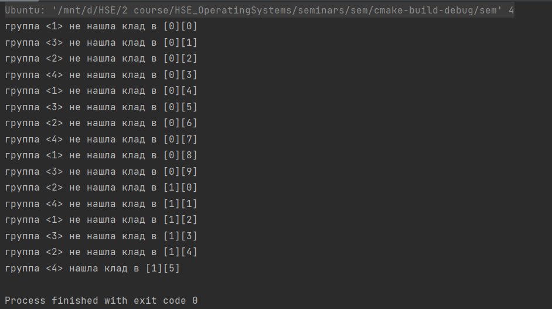
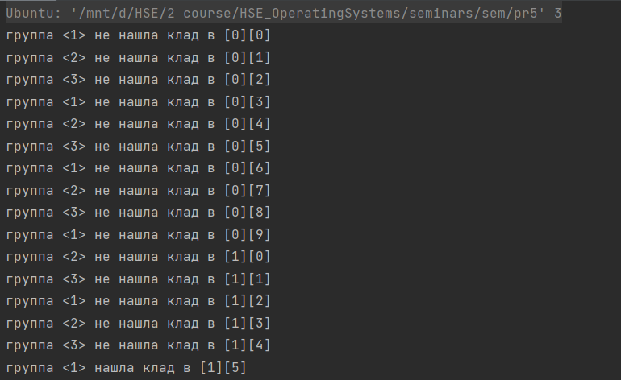
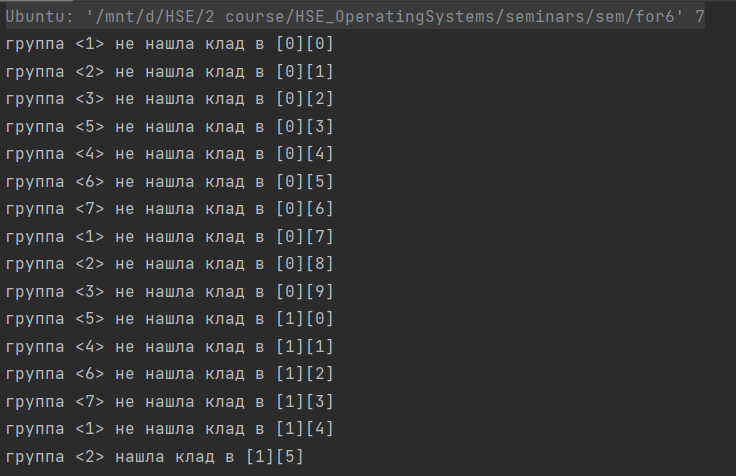
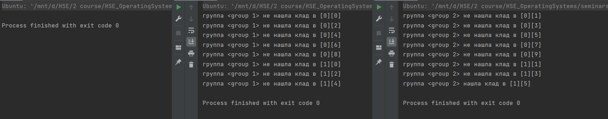
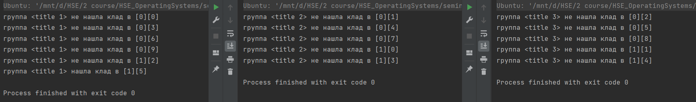
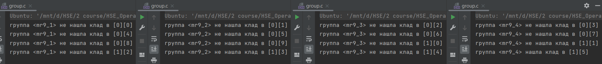

# # ИДЗ по ОС № 2
## Задание
- ### **формулировка**
    Вариант 31. Первая задача об Острове Сокровищ. Шайка пиратов под предводительством Джона Сильвера высадилась на берег Острова Сокровищ.Несмотря на добытую карту старого Флинта, местоположение сокровищ по-прежнему остается загадкой, поэтому искать клад приходится практически на ощупь. Так как Сильвер ходит на деревянной ноге,то самому бродить по джунглям ему не с руки. Джон Сильвер поделил остров научастки, а пиратов на небольшие группы. Каждой группе поручается искать клад на одном из участков, а сам Сильвер ждет на берегу. Пираты, обшарив участок, возвращаются к Сильверу и докладывают о результатах. Если клад не найден,то пираты назначаются на другой участок. Требуется создать приложение, моделирующее действия Сильвера и пиратов. Примечание. Количество участков превышает число поисковых групп.Сильвер и каждая группа пиратов задаются соответствующими процессами.. 
- ### **оценка**   
    Выполнено на оценку 10
- ### **Общая схема решения**
    Я представил остров в виде прямоугольного участка размером 3 на 10. Клад находится в клетке [1][5]. Эти данные решил сделать константными, иначе не смог бы их передавать через разделяемую память, но их можно поменять в коде. Главный процесс, представляющий Джона Сильвера, ждёт, когда дочерние процессы закончат исследовать очередную клетку и потом для каждой группы (дочернего процесса) он даёт новые координаты. Все группы последовательно обходят острова, идя слева направо. Когда какая-то из групп находит клад, то флинт и остальные группы прекращают поиск. Группа тратит одну секунду на исследование участка.
## Выполнение задания для каждого критерия
- ### **на оценкку 4**
    Для оценки 4 использовались именованные семафоры Posix, разделяемая память в стандарте Posix. Программа запускается одним исполняемым файлом, в аргумент командной строки нужно передать одно число - количество групп.
 - ### **на оценкку 5**
    Для оценки 5 использовались неименованные семафоры Posix, разделяемая память в стандарте Posix. Программа запускается одним исполняемым файлом, в аргумент командной строки нужно передать одно число - количество групп.
 - ### **на оценкку 6**
    Для оценки 6 использовались семафоры UNIX SYSTEM V, разделяемая память в стандарте UNIX SYSTEM V. Программа запускается одним исполняемым файлом, в аргумент командной строки нужно передать одно число - количество групп.
 - ### **на оценкку 7**
    Для оценки 7 использовались именованные семафоры Posix, разделяемая память в стандарте Posix. Процессы групп и капитана Джона являются независимыми и запускаются отдельными программами. Программа запускается одним исполняемым файлом, который был образован из файла main.c , и несколько другими исполняемыми файлами, образованными из файла group.c . Аргументы командной строки передавать только при запуске файлов group.exe, и при каждом запуске один аргумент - название группы. Перед тем, как процесс Джона начнёт работу, он ждёт 10 секунд, чтобы пользователь успел запустить нужное количество процессов групп.
 - ### **на оценкку 8**
    Для оценки 8 использовались семафоры UNIX SYSTEM V, разделяемая память в стандарте UNIX SYSTEM V. Процессы групп и капитана Джона являются независимыми и запускаются отдельными программами. Программа запускается одним исполняемым файлом, который был образован из файла main.c , и несколько другими исполняемыми файлами, образованными из файла group.c . Аргументы командной строки передавать только при запуске файлов group.exe, и при каждом запуске один аргумент - название группы. Перед тем, как процесс Джона начнёт работу, он ждёт 10 секунд, чтобы пользователь успел запустить нужное количество процессов групп.
 - ### **на оценкку 9**
    Для оценки 9 использовались именованные семафоры Posix, очередь сообщений в стандарте Posix. Процессы групп и капитана Джона являются независимыми и запускаются отдельными программами. Программа запускается одним исполняемым файлом, который был образован из файла main.c , и несколько другими исполняемыми файлами, образованными из файла group.c . Аргументы командной строки передавать только при запуске файлов group.exe, и при каждом запуске один аргумент - название группы. Перед тем, как процесс Джона начнёт работу, он ждёт 10 секунд, чтобы пользователь успел запустить нужное количество процессов групп.
 - ### **на оценкку 10**
    Для оценки 10 использовались семафоры UNIX SYSTEM V, очередь сообщений в стандарте UNIX SYSTEM V. Процессы групп и капитана Джона являются независимыми и запускаются отдельными программами. Программа запускается одним исполняемым файлом, который был образован из файла main.c , и несколько другими исполняемыми файлами, образованными из файла group.c . Аргументы командной строки передавать только при запуске файлов group.exe, и при каждом запуске один аргумент - название группы. Перед тем, как процесс Джона начнёт работу, он ждёт 10 секунд, чтобы пользователь успел запустить нужное количество процессов групп.

    **Коды всех программ на каждую оценку с комментариями расположены в папке c_programms**

## Тестирование
Я сделал 5 разных тестов для каждую оценки и запустил их. Ниже представлены результаты.
- ### Тест для оценки 4
    Тут я передал 4 в аргумент командой строки, и 4 группы искали клад.
    > 
- ### Тест для оценки 5
    Тут я передал 3 в аргумент командой строки, и 3 группы искали клад.
    > 
- ### Тест для оценки 6
    Тут я передал 7 в аргумент командой строки, и 7 групп искали клад.
    > 
- ### Тест для оценки 7
    Тут я запустил процесс капитана Джона, который синхронизируется с процессами групп, но ничего не выводит, и только 2 отдельных независимых процесса групп, их названия соотвественно "group 1" и "group 2".
    > 
- ### Тест для оценки 8
    Тест точно такой же, только 3 процесса групп и у них другие названия.
    > 
- ### Тест для оценки 9 и 10
    Программы запускаются и работают одинаково для оценок 7-10. Поэтому для оценки 9 и 10 покажу один тест, который выдаёт один и тот же результат для всех других оценок 7-10. В нём 4 процесса групп.
    > 
    
