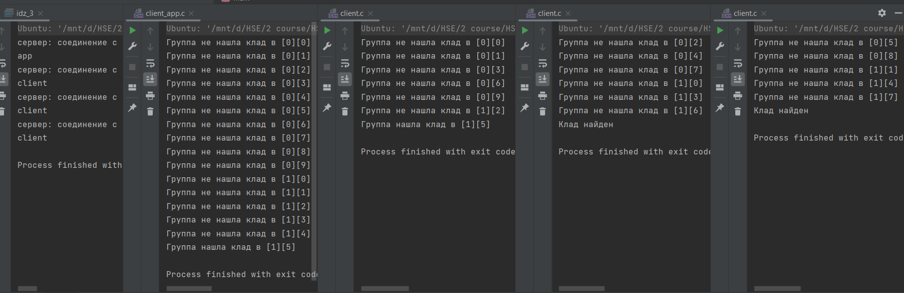

# # ИДЗ по ОС № 4
## Задание
- ### **формулировка**
    Вариант 31. Первая задача об Острове Сокровищ. Шайка пиратов под предводительством Джона Сильвера высадилась на берег Острова Сокровищ. Несмотря на добытую карту старого Флинта, местоположение сокровищ по-прежнему остается загадкой, поэтому искать клад приходится практически на ощупь. Так как Сильвер ходит на деревянной ноге, то самому бродить по джунглям ему не с руки. Джон Сильвер поделил остров на участки, а пиратов на небольшие группы. Каждой группе поручается искать клад на одном из участков, а сам Сильвер ждет на берегу. Пираты, обшарив участок, возвращаются к Сильверу и докладывают о результатах. Если клад не найден, то пираты назначаются на другой участок. Требуется создать приложение, моделирующее действия Сильвера и пиратов. Примечание. Количество участков превышает число поисковых групп. Сильвер—сервер. Каждая группа пиратов является клиентом. 
- ### **оценка**   
    Выполнено на оценку 10
- ### **Общая схема работы**
    Остров представляет из себя прямоугольную область, состоящую из клеток. При запуске сервера в аргументы передаётся порт, количество строк, количество столбцов. При запуске клиентского приложения ip-адрес, порт. При запуске обычных клиентов, которы представляют из себя групп пиратов, передаются ip-адрес, порт, координаты клада. При запуске сервера, он ждёт подключений. При подключении клиента-группы сервер передаёт ему координаты клетки, которую нужно проверить, после чего клиент-группа сообщает ему, был ли найден клад. В случае отрицательного ответа сервер даёт следующие координаты, и поиски продолжаются до тех пор, пока какая-то из групп не найдёт клад. Клиентские приложения просто отображают работу поиска всех групп.
## Выполнение задания для каждого критерия
 - ### **на оценкку 4-5**
    Сервер в бесконечном цикле while(1) принимает подключения клиентов. На каждое новое подключение сервер создаёт новый дочерний процесс, который обрабатыват клиента. Чтобы все процессы могли работать с одинаковыми данными, использовалась разделяемая память и семафоры в стандарте posix. 
 - ### **на оценкку 6-7**
    Всё работает так же, как на оценку 4-5, только перед бесконечным циклом сервер ожидает подклчючения клиентского приложения, куда потом будет доставляться информация о работе всей системы.
 - ### **на оценкку 8**
    Чтобы к серверу могли подключаться неограниченное число клиентских приложения, и чтобы всем им доставлялась информация о работе приложения, в разделяемой памяти был создан массив сокетов клиентских приложений, а так же количество подключенных клиентских приложений. Чтобы при подключении к серверу сервер смог распознать, какой именно тип клиента только что подключился, то клиентское приложений сразу после подключение отправляет серверу сообщение "app", а клиент-группа отправляет "client". Сервер получает это сообщение, и если только что было подключено клиентское приложение, то в массив сокетов добавляется новый сокет. Если же это клиент-группа, то она работает так же без изменений. При отправке сообщений клиентским приложений, сервер пробегается по массиву сокетов и отправляет всем данные.
 - ### **на оценкку 9-10**
    При завершении работы сервера все клиенты так же должны завершаться. При взаимодействии клиентов с сервером, если методы recv или send возвращают 0, то это значит что сервер отключен. При таком сценарии клиенты просто выключаются.

    **Коды всех программ на каждую оценку с комментариями расположены в папке c_programms**

## Тестирование
Я сделал 4 разных тестов для каждую оценки и запустил их. Ниже представлены результаты.
- ### Тест для оценки 4-5
    Остров размером 3 на 10, клад в клетке {1; 5}.
    > 
- ### Тест для оценки 6-7
    Одно клиентское приложение.
    > 
- ### Тест для оценки 8
    Несколько клиентских приложений.
    > 
- ### Тест для оценки 9-10
    При завершении работы сервера завершаются и клиенты.
     > 
    
